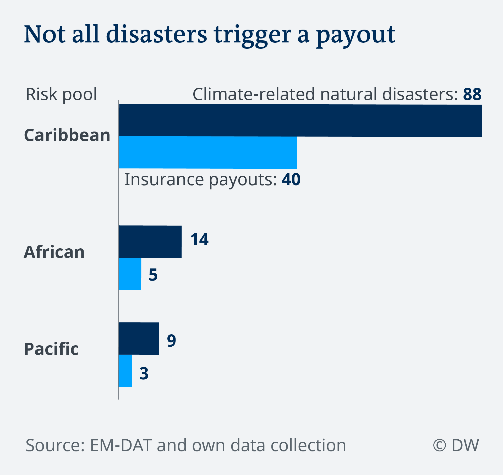
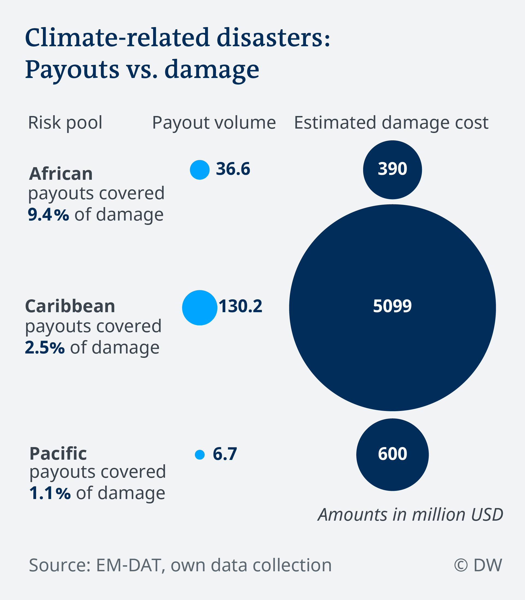

# Climate risk insurances: Are they worth the money?

**Story**: You can read the full story [here]()

**Idea, research and writing:** [Ruby Russell](https://twitter.com/rubyjrussell)

**Additional research, data analysis, data visualization:** [Gianna-Carina Grün](https://twitter.com/giannagruen)

# Data

## Natural disaster data

Natural disaster data is from the [EM-DAT: The Emergency Events Database - Université catholique de Louvain (UCL) - CRED, D. Guha-Sapir - www.emdat.be, Brussels, Belgium](https://www.emdat.be/). A FAQ on the database can be found [here](https://www.emdat.be/frequently-asked-questions). It includes information on when a disaster is registered as a datapoint in the database:

"EM-DAT includes all disasters from 1900 until the present, conforming to at least one of the following criteria:

* 10 or more people dead;
* 100 or more people affected;
* The declaration of a state of emergency
* A call for international assistance"

Behind each entry there are usually three to five sources it is based on. A committee of researchers decides on a case by case basis, whether an incident is entered into the database, as DW was told by one of EM-DAT's database managers. 

## Risk pool data

Data for the different risk pools was either publicly available or requested by DW directly from the risk pools.

CCRIF publishes annual reports that include their financial statements [in a separate section on their website](https://www.ccrif.org/content/publications/reports/annual); they also provide detailed information on payouts made [online](https://www.ccrif.org/content/about-us)

PCRAFI and ARC provided some of the requested information.

We compiled an Excel workbook with multiple sheets for each of the risk pools.

[Information on CCRIF (download Excel workbook)](data/CCRIF.xlsx)

[Information on ARC (download Excel workbook)](data/ARC.xlsx)

[Information on PCRAFI (download Excel workbook)](data/PCRAFI.xlsx)

# Data analysis

## Natural disasters in risk pools

For [data analysis of how weather-related disasters had an impact](Natural-disaster-damage-in-risk-pool-regions.ipynb) on risk pool regions, we considered three indicators:

1. The damage cost caused by natural disasters compared to the payouts being made by risk poosl
2. The frequency of natural disasters in general as well as compared to the number of payouts
3. The number of people so far affected by natural disasters

We wanted to get an impression of how much the payout volume by the different risk pools actually is in relation to how much damage was caused by natural disasters in the respective region. We included the following disaster types in our analysis: Droughts, floods, storms, and extreme temperature events.

CCRIF also insures against earthquakes, but since earthquakes are not related to weather, we excluded them (ground movements as well as tsunamis) from the analysis - both from the damage cost assessment as well as from the payouts. Same goes for the occurrence of natural disasters and the number of payouts.

For comparing the payout amount to the amount of damage that weather-related natural disasters caused in general, we chose to include not only disaster types that countries could buy an insurance policy for, but all weather-related natural disasters mentioned above. This choice leads to a bigger contrast between estimated damage cost and payouts than you'd see if only looking at damage cost caused by disasters that were insurable.

We made this decision in context of climate risk insurance as industralized countries feature climate risk insurances as one measure accounting for loss and damage in climate finance: By providing climate risk insurance assistance, they account for the damage caused by ultimately their CO2 emissions. This damage however is not restricted to the disasters that insurance policies exits for, but includes all damage caused by extreme weather events that are increasing under climate change. Thus, we wanted to assess the impact of insurance payouts in context of damage cost of all such disasters.

## Natural disasters globally

Besides focusing on the impact of weather-related natural disasters in risk pool regions particularly, we also wanted to understand how these fit in globally, so we analysed the impact of weather related natural disasters for the past 20 years globally. Details on this analysis can be found [in this notebook](Weather-related-disasters.ipynb).

## Caveats

* Our results may be inaccurate to the extent that we could not unambigously identify in all cases which country was in the member of a risk pool from which time point on. Thus, the analysis pretends that all current members of the respective risk pool have been insured since the establishment of each risk pool. Accordingly, the damage cost **is potentially lower than depicted**. 

* For some of the disasters listed in the EM-DAT database, the damage cost caused by a natural disaster is not available. Accordingly, the actual damage cost **is higher than the estimate depicted**.

Since - especially for the payouts and damage cost - the difference between both sums is so distinct, we came to the conclusion that this aspect does not change the picture in a significant sense and thus it is acceptable to use these figures despite potential inaccuracies. 

# Results

## Tabular
|Risk pool|Operational since |Payouts since(million USD)| Natural disaster damage cost in risk pool countries since (million USD)|Number of natural disasters since | Number of payouts since |
|:---------------------------|------:|---------:|-------:|------:|-----:|
|Caribbean risk pool (CCRIF) |  2007|  130.2 •|  5098.6|  88|  40|
|African risk pool (ARC)     |  2014|     36.6|     390|  14|   5|
|Pacific risk pool (PCRAFI)  |  2016|      6.7|     600|   9|   3|

• Earthquakes are excluded from CCRIF payout data, since this analysis only looks at weather related natural disasters

## Visuals

